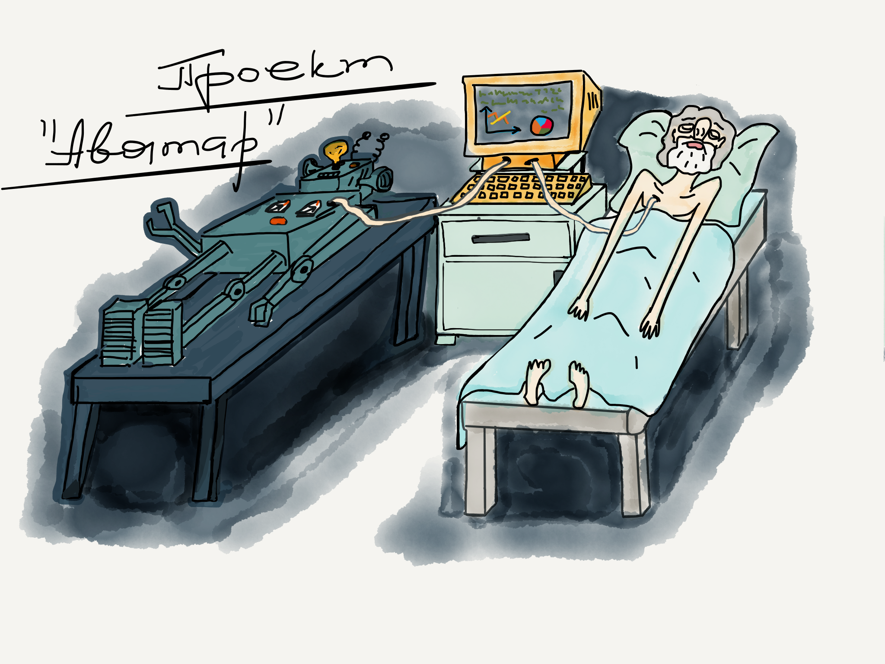
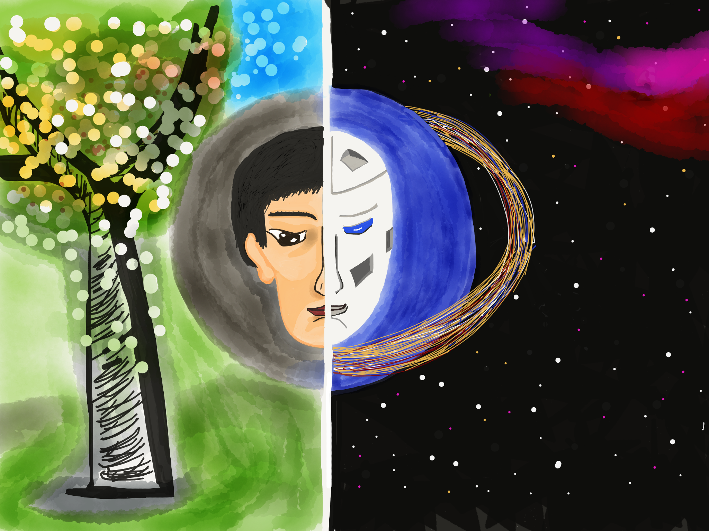

### Пролог
	

Сейчас набирает популярность общественное движение Россия-2045, пропагандирующее идею создания искусственного тела человека, более совершенного, в физическом смысле, чем человеческое. На текущий момент времени движение объединяет в рамках проекта «Аватар» огромное количество выдающихся специалистов, занятых решением задач первого технического плана, таких как создание нейроинтерфейса к примеру, или биомеханических аналогов человеческого тела.

Меня же, как профана в данных вопросах, но философа по призванию, интересует совсем другое. Мне не дает покоя мысль о том, как же будет выглядеть перевоплощение в новое тело, когда технические вопросы будут решены?

Меня мучает вопрос, а останусь ли, допустим я, собой, если мой разум скопировать и, после смерти моего физического тела, переписать на новый искусственный носитель интеллекта?

Как это будет? Я просто открою глаза, словно проснувшись, и осознаю себя в новом теле? Или же что-то, но не я, откроет глаза и будет искусственной, но неживой пародией на меня? С моей памятью, но не с моей душою? Вопрос? - Вопрос! Собственно, об этом и пойдет речь далее.

### Про логику и про борщ

Иногда состояние сна сравнивают с состоянием временной смерти. И это мнение логично, так как на время сна наше сознание отключается, мы как бы перестаем существовать в реальном мире. 

Если присмотреться к нашему утреннему пробуждению, то можно констатировать, что все мы, просыпаясь утром, ощущаем себя теми же, кем мы были вчера. Однако за то время пока мы спали, в нашем организме произошли определенные изменения. 

Внутри нашего тела умерло несколько миллионов клеток и столько же появилось новых, пришедших им на замену. Может быть менее совершенных, конечно, так как процесс старения никто не отменял, но, тем не менее, своих родных клеток. 

Предположим, мы поели вечером, на сон грядущий, борщ, который ночью, потихоньку перевариваясь, становился частью нашего организма. Ну, согласитесь, мы же не ощущаем так: что вот, я стал частью этого супа, что ел вчера на ужин. И атомы этого борща стали частью меня и поэтому какая-то часть меня это борщ.

-   Аааа! Моя нога это не я!!! Это борщ!!! 

Но ведь это абсурд и чепуха! Мы же так не чувствуем. Да, мы получили взамен другие клетки, пусть построенные из съеденного накануне борща,  но ведь все-таки это наши клетки. 

Или другой пример: допустим, у человека в сердце находится искусственный клапан. Бьется это сердце под управлением кардиостимулятора, в нем зашита программа, человек ходит на техобслуживание. 

Однако человек и в этом случае не перестает ощущать себя собой. Он знает, что внутри него работает искусственный клапан. Однако и он сам и его родные знают, что он это он. Хотя внутри него чужеродный искусственный механизм. Хмм...
 

Немного про аналогии и про китайцев

А может, чувство, что ты не совсем человек появится после замены более-менее значимой части тела. К примеру, если на искусственные компоненты заменено более половины тела? Как понять, как прочувствовать эту грань, за которой человек перестает быть человеком и становится бездушным механизмом?

Давайте введем аналогию и рассмотрим этот момент на ее примере. Для этого возьмем аналогию между общественным устройством и человеческим организмом. Вообразим, что отдельные люди, это вовсе не люди, а клеточки большого организма - общества. Представим себе, что точно так же как высокоразвитый организм составляют его клетки, наши отдельные люди все вместе составляют общество. 

Вы, может, не догадываетесь, но, говорят, у каждого человеческого организма должен быть разум (где-то в районе мозгов). Поэтому нам нужно представить, что у нашего организма-общества должен быть разум. Что можно принять аналогией разума? 

Мне думается, что для нашего примера аналогом разума человека, в сопоставлении обществу, могут выступить культура общества и его законы.

Перефразируем вопрос, озвученный в первом абзаце этого раздела: зависит ли культура и законы (разум) общества от того какие люди, в физическом, в генетическом смысле его составляют? 

Сейчас в нашем обществе обновление происходит так: одни члены общества  порождают похожих на них генетически, новых членов. Это так в подавляющем большинстве случаев. Намного реже происходит, что в наше общество привносится генетика из другого общества. 

Но мы же проводим мысленный эксперимент, правильно? Поэтому мы умозрительно будем брать, допустим, китайских детей, генетика которых иная и воспитывать в нашей среде, в нашей культуре до достижения ими взрослого состояния. Мы будем насыщать наше общество до состояния, когда китайская генетика будет превалировать над другими генетическими кодами, традиционными для нашего общества. 

Останется ли наше общество в этом случае нашим? Что будет, если россияне на 100%  будут генетическими китайцами, но китайцами, воспитанными в русской культуре, можно ли будет этот народ называть русскими? А если на 50%? 

Наверное, человеку, считающему себя чистокровным русским, хочется сейчас ответить - да никогда! И он, конечно же, будет по-своему прав. 

Однако, когда нам 20 лет отроду, то кажется, что когда нам будет 40, надо пойти и застрелиться, потому как так необъяснимо долго не живут даже мамонты.  И в этом взгляде тоже есть своя логика.

Дожив до сорока, с высоты прожитых лет мы можем констатировать, что я - это все еще я. Хотя и представляющий, в данный момент, из себя совершенно не то, что 20 лет назад. 

Вернемся к примеру с обществом. Понятно, что если изменения в нашем обществе производить постепенно, по капле, то, по-крайней мере, само это общество будет отождествлять себя с русским народом, хотя и будет отличаться от сегодняшнего его состояния разительно.  Но это процесс столь же непрерывный, сколь и естественный. Ведь даже наше сегодняшнее общество разительно отличается от общества, которым были мы каких-нибудь 20 лет назад. 

Сделаем вывод - разум (культура) стремится сохранить самое себя на любом носителе. Носитель важен, но только для физического материального мира, как сосуд для нематериального мира внутри себя - разума. Разум живет в мире не материальном.

	 

### О текущем состоянии и о пользе смерти

Мы становимся другими каждый день. Так как мы изменяемся ежедневно. Эти изменения в нас происходят непрерывно, но не заметно для нас.  Однако мы отождествляем себя, находясь в текущем состоянии с тем, кем мы были ранее. Наверное, правильно говорить о состоянии личности человека в конкретный момент времени. 

Личность человека развивается всю жизнь, и в отсутствие проблем физических достигает пика своего развития к закату жизни своего физического тела. И тут человека настигает смерть - не справедливый, казалось бы, итог жизни. Но, может быть, на то есть причины? 

Как мне кажется, одной из необходимостей наступления естественной смерти является насущная потребность в развитии далее. Да-да, именно потребность в развитии! Только не конкретного физического организма, а слепка личности этого организма, как нематериальной субстанции, носителя идей и концепций в составе общего информационного пространства и культуры, называемого цивилизацией.

Если мы прикладываем к тому усилия, то концентрированный слепок самых важных черт и опыта нашей личности мы можем передать следующему поколению. 

В то же время человек, накопивший определенный жизненный опыт и знания, стремится законсервировать текущую ситуацию, подгоняя ее под них. Его опыт делает его закосневшим и не гибким. 

Это свойственно людям, в биологических телах, так как в процессе эволюции в наше тело вложено стремление к минимальным затратам энергии, к максимальной экономии ресурсов. Для дикой природы этот механизм архиважен, так как позволяет выживать в условиях постоянного дефицита ресурсов. Для нас, сегодняшних людей, этот механизм стал атавизмом и порою не дает нам двигаться вперед. Мы даже пренебрежительно называем этот механизм ленью, которая, тем не менее, как известно, является матушкой прогресса.

Как же происходит развитие цивилизационного организма? Новое поколение людей, получив от предыдущего концентрированный опыт, отвоёвывая для себя место под солнцем, перерабатывает этот опыт, рождая новые знания скачкообразным, прорывным образом. Оно основывает свою логику на основе опыта предыдущих поколений, но оно не связано путами собственного опыта и поэтому свободно творить, создавая свою, новую реальность, отличную от реальности, в которой жили их предки.

 
### Немного о феномене личности человека 

В целях рассмотрения сути рассматриваемого вопроса, необходимо разделить личность человека на некоторые составляющие его единицы. Итак, что же составляет личность человека? Предположу что это сознание, анализатор (интеллект) и память. 

Начнем с сознания. Что же такое сознание человека? Понятие сознания человека неотрывно от его тела, так как только тело с его органами чувств позволяет выделить себя (с помощью анализатора, о котором ниже) из окружающей среды и осознать как нечто самостоятельное. 

Поэтому сознание человека нельзя сохранить в компьютер, так как это свойство человеческого тела, его характеристика, если хотите. Ведь без тела нельзя себя осознать. Однако, я думаю, что сознание не является мерилом индивидуальности - мы каждую ночь отключаем сознание, а с утра оно включается уже немного в другом теле и ничего, индивидуальность наша при себе. 

Отсюда вывод: Для проявления сознания необходимо наличие тела, при этом сознание не является мерой индивидуальности, а тело является и придает личности индивидуальность. 

Сменив тело, мы поменяемся сами, но это не страшно, если сохранена преемственность с нашими предыдущими состояниями, о чем мы говорили уже выше. 

Анализатор или по-другому интеллект. Интеллект, это способность компилировать, синтезировать, интегрировать, дифференцировать (и еще много разных других умных слов) имеющиеся данные и в результате получать новые. Способность на эти действия у человека меняется в течение всей жизни, при этом наиболее высокая она в детстве и снижается к старости, так как мозг стареет. 

Это изменение способности оперировать с информацией в течение жизни также не разрушает личность. Таким образом, если мы сменим мыслительный аппарат достаточно плавно, то это также не вызовет непоправимых изменений личности. 

Память человека. Память человека бывает долговременная и кратковременная. Все, что происходит до момента сна, хранится в краткосрочной памяти. В момент сна эта информация переупаковывается в долговременную память. Таким образом, память это способность сохранять информацию в структурах мозга. То есть специфический биологический механизм сохранения информации. 

Этот механизм также претерпевает изменения в эффективности своей работы на протяжении жизни человека. К старости способность запоминать у многих людей слабеет. Однако и этот механизм, изменяясь, не влияет на способность человека ассоциировать себя с собой.

Таким образом, мы подошли к выводу, что ядром личности человека являются данные, хранящиеся в его памяти. Именно эти данные (нематериальные!) критично важны для сохранения преемственности состояний личности в течение всей жизни. Очевидно, что наиболее важной в разрезе сохранения индивидуальности является информация, хранимая в долговременной памяти. Но для обеспечения преемственности состояний личности, возможно, необходимо сохранять и те данные, которые хранятся в кратковременной памяти.

Лишение человека данных, хранимых в его памяти, конечно же, лишает человека индивидуальности. Но в то же время, информация, данные о личности человека - параметр, практически независимый от типа носителя, на котором он хранится. И это свойство данной информации является ключевым. 

Как это ни странно звучит, но ядро личности человека – это информация, то есть нематериальный продукт!

 
### В заключении немного об итогах и о беременности цивилизации

Подытоживая все сказанное, делаем вывод, что переход к новому искусственному телу, должен происходить не скачком, а постепенно, чтобы личность не потеряла связь со своими предыдущими состояниями. 

ВАЖНО! Не принципиально, каким будет тело, сознание и интеллект в новом создании. Для сохранения личности и ее индивидуальности крайне необходимо обеспечить лишь плавную преемственность состояний личности (включая преемственность состояний тела), в процессе перехода в искусственное тело, а также сохранение данных  долговременной памяти личности. 

Предположим, что человек получил новое, искусственное тело и все прошло отлично. Создание открыло глаза и проявило признаки разумности, более того оно проявило признаки той личности, которую вселили в новое тело. Что же дальше?

А дальше таких людей будет появляться все больше и больше. Людей со сверхспособностями, с абсолютно другими способами взаимодействия с реальностью. Да, преемственность с человеческим прошлым, возможно, сделает этих созданий человечными, но все же они будут жить в параллельной реальности, по отношению к обычным людям.

Для примера посмотрите на нас, как живем мы. В большинстве своем люди существуют внутри поколенческих слоев общества, если можно так выразиться. Мы живем поколениями. Внутри поколений формируется одна культурная, ценностная и мировоззренческая среда. И человек существует внутри этого слоя.  Когда же начинает умирать свое поколение, люди начинают чувствовать себя все более и более одинокими – посмотрите хотя бы на стариков. Зачастую им одиноко, так как все их друзья и знакомые покинули этот мир. Хотя, казалось бы, вокруг них полно людей.

Вернемся к нашему сверхчеловеку, победившему смерть. Согласитесь, идея создания сверхчеловека отнюдь не новость для человечества. Эта идея стара как мир, но, не буду останавливаться здесь подробно.

Наше человеческое общество уже давно беременно новым сверхчеловеком, но вот в чем закавыка: после «рождения» нового сверхчеловека, родившее его общество сразу станет для него архаичным. 

Да, он будет любить человеческую цивилизацию, так же как дитя обожает свою мать, но ему потребуются друзья, подобные ему самому. Нашему новому сверхчеловеку, потребуется новый сверхслой общества. Общество сверхлюдей со сверхцелями, сверхкультурой и сверхцивилизацией.

Поэтому после окончания формирования нового создания со сверхспособностями должен быть произведен скачкообразный переход в другую реальность,

	

на другую ступень развития. Символизирующий "смерть" или "рождение" - кому как больше нравится. Может быть что-то, вроде обряда инициации у первобытных племен. 

Этакая дверь в новую реальность для вновь рожденной личности (впервые в истории сохранившей связь со своим предыдущим белковым состоянием). Это, наверное, будет реальность по ту сторону сингулярности, недоступная пониманию обычного человека, но понятная и доступная для изучения Новым Человеком. 

Все же человеком, а не киборгом. Человеком, в котором искусственный интеллект станет его неотъемлемой частью. Человеком, получившим сверхчеловеческие способности. Чтобы на новом уровне сознания отслеживать процессы развития и непосредственно участвовать в развитии прогресса и творить. 

Творить, пребывая в новой реальности, в среде себе подобных сверхлюдей или сверхсуществ!
	 
 

P.S.

Традиционное же общество, надо полагать, превратится, в буквальном смысле, в колыбель цивилизации. Этакие ясли, в которых взращиваются сверхлюди, под присмотром сверхлюдей.
 

19 декабря 2015 года
