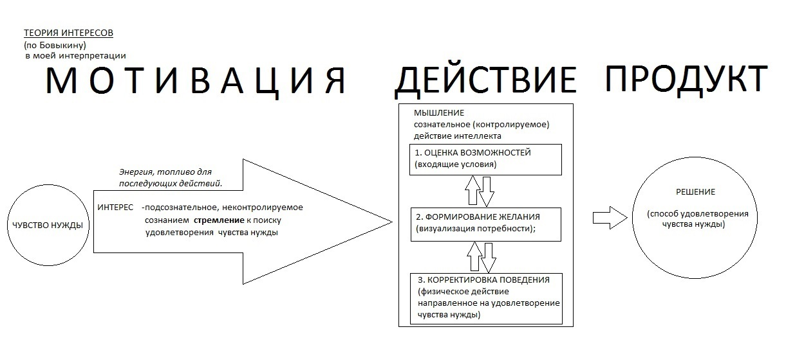
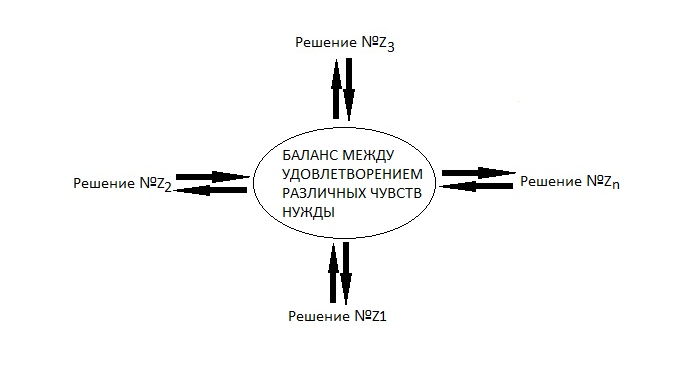

Прежде всего об авторе книги.

Итак, Владимир Иванович Бовыкин, написавший книгу, является основателем школы так называемой "Рациональной Модели Трудовых Отношений" (далее РМТО). Родом из Перми, в которой его идеи нашли благодатную почву для внедрения на нескольких предприятиях. 

Становление управленческих взглядов В.И.Бовыкина, вылившееся в концепцию школы РМТО произошло в 90-х годах ХХ века. Школа основана на работах основоположника научной школы управления Фредерика У. Тейлора и основоположника классической (бюрократической) школы административного управления Анри Файоля.

На протяжении  всей книги интерес читателя подогревается обещаниями раскрыть секрет эффективного управления организацией, через раскрытие секрета управления мотивацией работников. Я не знаю, то ли книга у меня неполная, то ли я чего-то не понял, но до раскрытия секретного метода управления мотивацией дело так и не дошло.

Книга закончилась на туманном формулировании теории интересов, которую я, с учетом предыдущих знаний, оформил в схему (см. Рис. 1, Рис. 2). Почитав отзывы о внедрении данной системы на предприятиях (а сегодня, на минуточку, 2017 год) я понял, что РМТО представляет собой организационную структуру с жесткой вертикальной иерархией управления, в которой применяется оплата труда с плавающим окладом. 

  
									

При этом горизонтальная иерархия представлена своеобразным подходом к оплате труда: при выявлении какого-либо недочета при выполнении задания (оценки выставляет вышестоящий руководитель на каждой ступени иерархии) наказывается весь нижестоящий персонал. Т.е. предположительно, коллеги сами найдут бракодела и разберутся с ним.

Кроме этого, автор утверждает, что эффективное руководство персоналом обязано учитывать менталитет работников. При этом  постулируется утверждение, что для нашей действительности, жесткий авторитарно-деспотический режим является единственно верной и эффективной моделью управления на всех уровнях вертикальной иерархии.

Что ж, мнение понятно. Более того, до боли знакомо. Может быть в нашей компании руководителя являются последователями данной точки зрения?

Теперь о самой книге.
Несмотря на то, что автор пытался копировать дебильный западный стиль изложения, книга все же получилась достаточно информационно насыщенной. Видимо сказалось советское образование все-таки. 

Чувствуется теоретический базис и способность к самостоятельной аналитике. Выводы читать интересно. Можно сказать, автор провел анализ современного, на тот момент, состояния управленческой науки и в книге изложил свои выводы в виде реферата.

Это мне сэкономило массу времени и позволило получить готовую выжимку-обзор по истории становления менеджмента. Позволило сформировать общее представление о движении научной мысли в области управления, а также понять проблематику современных управленцев-практиков.

Первую часть книги, достаточно растянутую, я считаю, занимают кейсы успешного применения данной модели на действующих предприятиях и хвалебные отзывы руководителей этих компаний. Сути происходящих изменений, естественно, никто не раскрывает, сохраняя интригу.

Далее идет достаточно подробный обзор подходов к управлению в исторической ретроспективе. В частности говорится что выделяется четыре подхода к управлению:
	- На основе выделения школ управления;
	- Процессный подход (Питера Друкера);
	- Системный подход;
	- Ситуационный подход;
	
Далее идет обзор взглядов различных школ и их вклад в копилку науки управления. Школ выделено также четыре:
	- Школа научного управления, основоположником которой является Фредерик У. Тейлор;
	- Классическая школа административного управления (бюрократическая школа) Анри Файоля;
	- Поведенческие школы и школа человеческих отношений;
	- Школа количественного (экономического) подхода;

Обзор взглядов данных школ я описал в конспекте, здесь повторяться не буду.

Далее была рассмотрена концепция внешней и внутренней эффективности организации. Причем концепция выражена простой формулой:
							Эобщ.= Эвнеш. Х  Эвнутр.
Соответственно, за внешнюю эффективность организации отвечает маркетинг, а за внутреннюю - наука менеджмента.

При этом высказана интересная мысль: в отсутствие сильной конкуренции на рынке, то есть в условиях монополии, либо близком к монополии положении вещей внутренняя эффективность организации часто остается вне поля зрения руководства, так как не влияет на выбор покупателя и определяется только лишь первой составляющей - маркетингом.

Вторая составляющая - внутренняя эффективность начинает проявлять себя тогда, когда у покупателя есть выбор, то есть в условиях конкуренции. Для того чтобы получать прибыль, в этих условиях, компаниям необходимо снижать издержки на производство, а значит повышать свою внутреннюю эффективность. То есть оптимизировать затраты на сырье, содержание техники и фонд заработной платы.

Внутренняя эффективность компании, по мнению автора, напрямую зависит от уровня производительности труда на каждом месте. Поэтому задача повышения внутренней эффективности сводится к увеличению совокупной производительности труда (этот вывод, вообще говоря, совершенно не очевиден). 
Совокупная производительность труда также представлена соотношением вида:
							С = И Х  Т;
, где И - индивидуальная  производительность труда каждого работника;
          Т - производительность организационно-технических средств компании;
	
Далее сформулировано необходимое условие повышения совокупной производительности труда:

"максимальная личная заинтересованность работников в высокопроизводительном труде (необходимое условие) и внедрение методов научной организации труда наряду с совершенствованием средств производства (достаточное условие)".

Индивидуальная производительность труда может быть только при наличии максимальной личной мотивации работника.

Далее вводится понятие механизма эффективной мотивации, т.е. такой мотивации, которая бы учитывала сложную природу человека и обеспечивала бы его рациональное поведение по отношению к организации (с точки зрения руководителя, хочу здесь заметить).  И говорится, что без этого механизма, все стройное здание современной управленческой теории обречено на обрушение.

Далее постулируются несколько, так называемых, "законов". Итак законы:

"Закон роста сложности" - речь идет о том, что

	-  "если не решена задача мотивации, количество задач на пути создания внутренне эффективной организации подвержено квадратичному росту (N2) от количества персонала в ней (N)".

"Закон возрастающей неопределенности" - 

	-  "если не решена задача мотивации, то на пути к эффективному управлению степень неопределенности или доля управленческих задач, изначально не поддающихся решению никакими из существующих методов управления, возрастает по мере увеличения численности персонала на предприятиях (хотя остается соразмерно великой для них всех)".

"Закон обратного эффекта" - 
	-  "если не решена задача мотивации, попытки повысить эффективность управления всегда приводят к обратному эффекту".

Глава 7

Выводы главы:
	1. Система управления организации в целом должна иметь в себе две подсистемы:
	• Эффективную систему управления персоналом, функционирующую по законам эффективной мотивации;
	• Эффективную систему управления организационно-техническими средствами, функционирующую по законам эффективной организации труда с учетом горизонтального и вертикального его разделения и на основе используемых производственных технологий;

	2. Уровень эффективности системы управления организацией зависит от эффективности системы управления персоналом и эффективности системы управления организационно-техническими средствами:
								Sc = Sи Х Sт;
								
	3. Необходимо разработать технологию, позволяющую руководителю абстрагироваться от "сложного человеческого материала", вывести универсальный закон позволяющий однозначно и правильно трактовать все многообразие человеческих реакций и психологии. Естественно это нужно для более успешной и удобной манипуляции поведением людей на благо производительности (читай увеличения прибыли эксплуататора).

